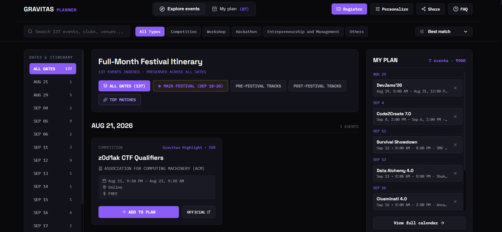
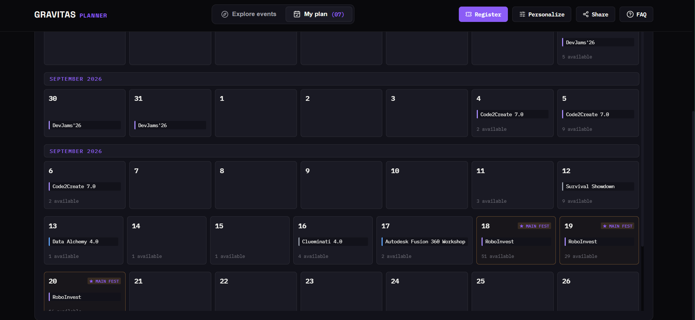

# Gravitas '26 Planner

A personalized event planning companion for **Gravitas**, VIT Vellore's annual tech fest. Instead of scrolling through a long list of events trying to figure out what's worth attending and whether anything clashes, this tool ranks events based on your interests, lets you build a plan visually on a calendar, flags scheduling conflicts, and exports everything to your personal calendar.

**Live demo:** [gravitas-planner.vercel.app](https://gravitas-planner.vercel.app/)

> ⚠️ **Unofficial, student-made planner.** This is an independent project, not affiliated with VIT or the official Gravitas organizing committee. Always verify event timings and complete registration on the official Gravitas/VTOP portals.

---

## Screenshots

| Explore & personalized recommendations | Festival overview |
|---|---|
|  |  |

---

## What it does

- **Personalized recommendations** — Pick your primary goal (build, compete, learn, network, or explore everything) and rank your technical interests. Every event gets a transparent match score (e.g. `92% match · AI 70 · Web 18`) so you know exactly why it's recommended.
- **Explore & filter** — Search and filter 137+ events by type (Hackathon, Workshop, Competition, etc.), sort by best match, soonest, free-first, or shortest duration.
- **Visual planner** — Add events to "My Plan" and see them laid out across the whole festival: a month-style overview, a day timeline, an agenda list, or a full week view.
- **Conflict detection** — Automatically flags overlapping events in your plan, with the option to ignore a clash if it's not actually a problem for you.
- **Export your plan:**
  - 📅 **Download as `.ics`** — imports directly into Apple Calendar (just open the file) or Google Calendar (via Import & Export in settings).
  - 📋 **Copy as text** — a clean, readable list of your events with dates, times, venues, and costs — no calendar app needed.
  - 🔗 **Share with a friend** — generates a link that pre-loads your exact event selections for anyone who opens it.
- **No accounts, no backend** — your plan and preferences are stored only in your browser (`localStorage`). Nothing is sent to a server.

---

## Tech stack

- **React** + **Vite** — frontend and build tooling
- **FullCalendar** (`@fullcalendar/react`) — calendar rendering (day/week/list views)
- **ics** + **file-saver** — client-side `.ics` calendar file generation
- **lucide-react** — icons

---

## Data source & disclaimer

Event data (dates, venues, hosting clubs, prices, descriptions) is bundled into the app as a static dataset (`src/data/events_scored.json`), originally sourced from the official Gravitas event listings. It does **not** update automatically — event details may change closer to the festival, so always double-check timings on the official Gravitas/VTOP pages before attending. Registration always happens on the official VIT portals; this app never collects login credentials.

---

## Running it locally

```bash
git clone https://github.com/rickastley12/gravitas-planner.git
cd gravitas-planner
npm install
npm run dev
```

The app will be available at `http://localhost:3000` (or the next available port).

To build for production:

```bash
npm run build
```

Output goes to the `dist/` folder.

---

## Updating event data

Event data lives in `src/data/events_scored.json`. To refresh it, replace this file with an updated dataset in the same shape and redeploy — no other code changes are needed for new events to show up.
